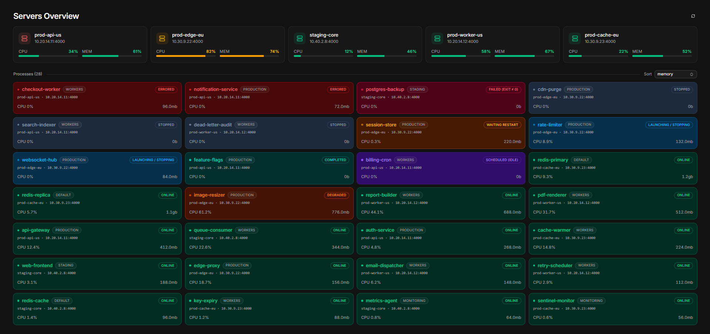

<h1 align="center">Cross-Server Process Manager (XPM)</h1>

<b>Every server. Every process. One dashboard.</b>

  <b>Running your processes with PM2? This one's for you.</b> 
  The control plane for <a href="https://github.com/marksxiety/xpm-agent">xpm-agent</a> —
  watch and control every process from here.

## The 2 AM problem

An application is down. You don't know which server it's on, so you SSH into the first one and run `pm2 list`. Not there. Second server. Not there either. By the time you find it on server four, you've opened four terminals, typed the same three commands sixteen times, and you're no closer to knowing *why* it crashed — just that it did.

Multiply that by however many boxes run your stack, and "checking on PM2" quietly becomes a tax you pay every incident.

### What PM2 is, for context

PM2 is a process manager — the engine that keeps your apps alive in the background, restarts them when they crash, and tracks their logs and resource usage. If you run Node.js, Python, PHP, or background workers on a server, PM2 is very likely what's keeping them running. It's excellent at its job. It just only ever shows you one machine at a time.

### The solution

**Cross-Server Process Manager (XPM)** ends the hunt. It connects to every server running [`xpm-agent`](https://github.com/marksxiety/xpm-agent) at once and pulls all of your processes into a single browser window. No SSH. No memorized flags. One screen that tells you everything you'd otherwise log in five times to learn.

* **Complete visibility:** every process, status, CPU load, and memory footprint across all nodes at once.
* **Direct control:** start, restart, reload, stop, or flush logs on any server from the UI.
* **Unified diagnostics:** tail stdout and stderr from any process without a terminal.

## How it works

XPM is two workspaces in this repo, plus the agent that runs on every monitored server:

| Piece | Where | Role |
|---|---|---|
| **xpm-web** | this repo (`web/`) | The dashboard you open in the browser |
| **xpm-server** | this repo (`server/`) | Registry API — stores your server list (PostgreSQL) |
| **xpm-agent** | separate repo — [`xpm-agent`](https://github.com/marksxiety/xpm-agent) | REST wrapper around PM2 — one per server, the only thing that touches PM2 |

The dashboard reads your server list from **xpm-server**, then talks to each **xpm-agent** directly to pull live process data and send lifecycle commands. Agents are guarded by `AUTH_TOKEN`; give the dashboard the matching `VITE_AGENT_AUTH_TOKEN`.

**New here?** See it instantly with sample data → **[docs/setup-demo.md](docs/setup-demo.md)**.
Ready to connect your own servers → **[docs/setup-actual.md](docs/setup-actual.md)**.

## What you can do

- **See every process at a glance** — every server, every process, on one dashboard
- **Spot trouble instantly** — health warnings and problem processes rise to the surface before you even click
- **Inspect anything, anywhere** — open any process and get its full story: how it's running, how it's been behaving, and what it's saying
- **Follow live logs** — watch stdout/stderr stream in as it happens, no terminal required
- **Register new services in minutes** — guided setup with ready-made templates and a production-ready config you can copy in one click
- **Watch it anywhere** — including fullscreen, for a dedicated ops screen

## What you can monitor

| Level | Metrics |
|---|---|
| **Server** | CPU load, memory usage, health status (online / warning / critical / offline) |
| **Process** | CPU %, memory, status, PID, uptime, restart & unstable-restart counts, exec mode, instances, interpreter, watch & autorestart flags, working directory |
| **Logs** | stdout / stderr, last 5–300 lines, optional auto-refresh |

## Platform Support

**Windows is fully supported today.**

| Platform | Status | Notes |
|---|---|---|
| **Windows** | Supported | End-to-end: dashboard, registry, and agents that boot with the machine via [`pm2-windows-startup`](https://www.npmjs.com/package/pm2-windows-startup) |
| Linux / macOS | Not yet | The agent only ships Windows boot integration for now |

Want to run XPM on another OS? Open an issue — contributions are welcome.
